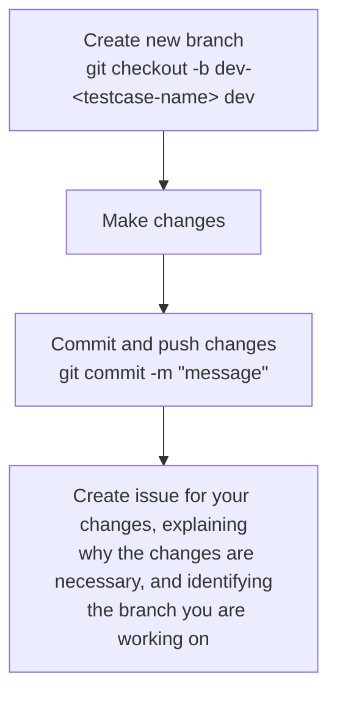

# Contributing

Please create a new branch for your changes and make a pull request to the `main` branch.
## Workflow

## Requirements

The following python packages will be required to push testcases to the repository:

- `black`
- `isort`

To install these packages, run the following command:

```bash
pip install -r dev-requirements.txt
```

This will install the required packages.

## Creating a Testcase

To create a template for a testcase, run `test.py create`

A testcase is a directory containing three files:

 - `input.[brf|txt]`: The input file.
 - `output.[brf|txt]`: The output file.
 - `manifest.json`: The manifest file.

The input and output files are the Braille and Afrikaans files. The manifest file contains metadata about the testcase. Read more about the manifest file [here](./MANIFEST.md).

### Example Testcase
(Find this example in the [`my-simple-testcase`](testcases\my-simple-testcase) directory in the repository)
```
my-simple-testcase/
├── input.txt
├── output.brf
└── manifest.json
```
`mainfest.json`:
```json
{
    "$schema": "../schema.json",
    "name": "My Simple Testcase",
    "description": "This is a simple testcase",
    "level": "1.0",
    "direction": "afrikaans-to-braille",
    "tags": ["text"]
}
```

`input.txt`:
```
dit is warm
```

`output.brf`:
```
145-24-2345 24-234 2456-1-1235-134
```
