# RW214-project-testcases


Shared testcases for the 2024 RW214 project.

## Usage

### Installation
Suggested installation location is adjacent to the project directory. i.e.)
```
your/path/to/
    RW214-project-testcases/ (This repository)
      |--- testscript/
      |--- testcases/
      |--- ...
    <student-number>-RW214-project/ (Your project directory)
      |--- src/
      |--- bin/
      |--- ...
```
#### For basic users
Run all commands in terminal

```mermaid
graph TD
    Clone["`Clone the repository

**git&nbsp;clone&nbsp;https://github.com/lo9ud/RW214&#8209;project#8209;testcases.git**`"]
    CD["`Change directory to the test script repository

**cd&nbsp;RW214#8209;project#8209;testcases**`"]
    Locate["`Locate project folder path

**your/path/to/RW214#8209;project#8209;testcases**`"]
    Run["`Run the test script

**python&nbsp;testscript&nbsp;test&nbsp;#quot;your/path/to/project#quot;**`"]
    Clone --> CD --> Locate --> Run
```

If you are a basic user, you do not need to install any additional packages, nor do you need to read any more of this README. You can simply follow the instructions above to run the test script.

>*Note: you are in fact running the <b>folder</b> `/testscript/` as a script. This is normal.* ___THIS IS INTENDED BEHAVIOUR.___ *Do not add `.py`, `/test.py`, or any other suffix to the command.*

#### For developers and more advanced users
```
% user@machine:~$ python testscript -h
usage: testscript [-h] [--version] [-c] [-p] {test,validate,create} ...

Test script for the RW214 Braille-Afrikaans Translator project

positional arguments:
  {test,validate,create}
                        Action
    test                Run tests
    validate            Validate testcases
    create              Create a new testcase

options:
  -h, --help            show this help message and exit
  --version             show program's version number and exit
  -c, --no-color        Disable color output
  -p, --no-pretty-print
                        Disable pretty print for tabular data
```
To run the tests, run `test.py test`

```
% user@machine:~$ python .\testscript\test.py test path/to/proj/dir/
```

To validate the testcases, run `test.py validate`

```
% user@machine:~$ python .\testscript\test.py validate
```

To create a template for a testcase, run `test.py create`

```
% user@machine:~$ python .\testscript\test.py create
```

All subcommands have a `-h` option to allow you to explore their other options.

## Contributing

It is strongly recommended to use the main branch for testing. THere are no guaranteees that other branches will be up to date or correct.


Please create a PR with your proposed testcases. The testcases will be reviewed and merged if they meet the requirements. You may also open an issue to discuss the testcase before creating a PR, or upload it there if you do not know how to create a PR.

If an issue is found with a testcase, please create an issue with the testcase name and a description of the issue, using the issue tracker.

Read more about contributing [here](./CONTRIBUTING.md).

# WARNING

DO NOT PUT ANYTHING HERE WHICH COULD BE CONSIDERED PLAGIARISM. YOU WILL BE PERMANENTLY PREVENTED FROM CONTRIBUTING, YOUR CHANGES WILL BE ROLLED BACK, AND YOU WILL BE REPORTED TO THE LECTURER!
